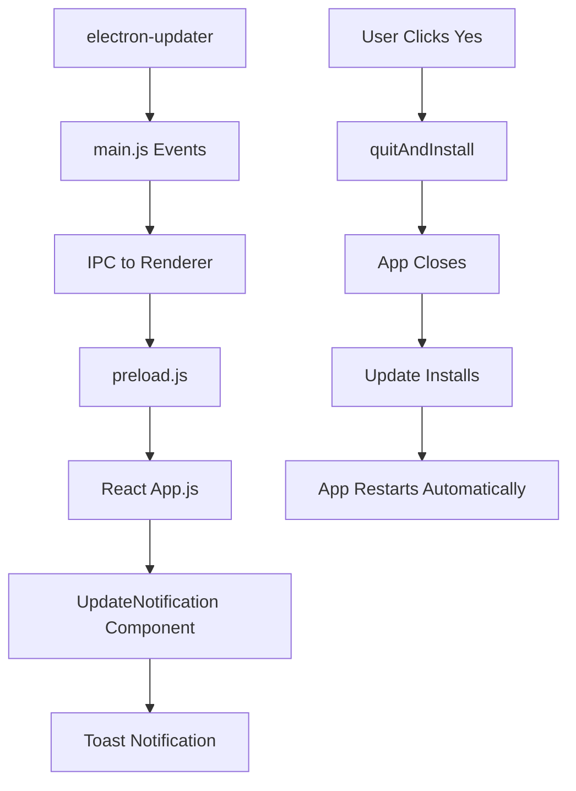

# Diseño del Sistema de Notificaciones de Actualización

## Arquitectura General



## Componente UpdateNotification

### Estados del Componente
- `idle`: Sin actualizaciones
- `checking`: Verificando actualizaciones
- `available`: Actualización disponible
- `downloading`: Descargando actualización
- `downloaded`: Descarga completada
- `error`: Error en el proceso

### Diseño Visual
- **Posición**: Esquina superior izquierda (top: 20px, left: 20px)
- **Estilo**: Toast notification discreta
- **Animación**: Slide-in desde la izquierda
- **Tamaño**: Máximo 300px de ancho, altura automática
- **Transparencia**: Fondo semi-transparente (rgba(255, 255, 255, 0.95))

### Contenido por Estado

#### Estado: `available`
```
┌─────────────────────────────────┐
│ 🔄 Nueva actualización disponible │
│ Versión: v1.0.4                 │
│ [Descargar] [Ignorar]           │
└─────────────────────────────────┘
```

#### Estado: `downloading`
```
┌─────────────────────────────────┐
│ ⬇️ Descargando actualización...  │
│ ████████░░ 80% (1.2 MB/s)      │
│ 15.2 MB / 19.0 MB              │
└─────────────────────────────────┘
```

#### Estado: `downloaded`
```
┌─────────────────────────────────┐
│ ✅ Actualización descargada      │
│ ¿Instalar y reiniciar ahora?    │
│ [Sí] [Más tarde]               │
└─────────────────────────────────┘
```

#### Estado: `error`
```
┌─────────────────────────────────┐
│ ❌ Error al actualizar          │
│ No se pudo descargar            │
│ [Reintentar] [Cerrar]          │
└─────────────────────────────────┘
```

## Flujo de Interacción

### 1. Detección de Actualización
- Notificación aparece automáticamente
- Usuario puede descargar o ignorar
- Si ignora, la notificación desaparece por 1 hora

### 2. Proceso de Descarga
- Barra de progreso en tiempo real
- Velocidad de descarga mostrada
- Tamaño total y descargado
- Cancelable por el usuario

### 3. Instalación
- Mantiene el diálogo modal existente de confirmación
- Si acepta: App se cierra → Instala → **Reinicia automáticamente**
- Si rechaza: Notificación se oculta temporalmente

### 4. Manejo de Errores
- Notificación de error específica
- Opción para reintentar
- Log del error para debugging

## Configuraciones Técnicas

### CSS Classes
```css
.update-notification {
  position: fixed;
  top: 20px;
  left: 20px;
  z-index: 9999;
}

.update-notification--slide-in {
  animation: slideInLeft 0.3s ease-out;
}

.update-notification--slide-out {
  animation: slideOutLeft 0.3s ease-in;
}
```

### Props del Componente
```typescript
interface UpdateNotificationProps {
  status: 'idle' | 'checking' | 'available' | 'downloading' | 'downloaded' | 'error';
  updateInfo?: {
    version: string;
    releaseNotes?: string;
  };
  downloadProgress?: {
    percent: number;
    speed: number;
    transferred: number;
    total: number;
  };
  error?: string;
  onDownload: () => void;
  onInstall: () => void;
  onIgnore: () => void;
  onRetry: () => void;
  onClose: () => void;
}
```

## Integración con Sistema Existente

### Mantener Funcionalidades Actuales
- ✅ Diálogo de confirmación existente
- ✅ Auto-download habilitado
- ✅ Auto-install en cierre de app
- ✅ Verificación solo en producción

### Nuevas Funcionalidades
- 🆕 Notificaciones discretas en UI
- 🆕 Progreso visual de descarga
- 🆕 Reinicio automático después de instalación
- 🆕 Manejo de errores mejorado

## Consideraciones de UX

### Accesibilidad
- Contraste adecuado para texto
- Tamaños de botón apropiados (mínimo 44px)
- Soporte para navegación por teclado
- Aria-labels para lectores de pantalla

### Performance
- Componente lazy-loaded
- Animaciones optimizadas con CSS transforms
- Debounce en eventos de progreso
- Cleanup de listeners al desmontar

### Responsive
- Adaptable a diferentes tamaños de ventana
- Posición fija que no interfiera con contenido
- Texto que se ajuste al ancho disponible

## Estados de Persistencia

### Durante Actualización
- Guardar estado de campaña activa
- Preservar configuración de usuario
- Mantener sesión de WhatsApp si es posible

### Después del Reinicio
- Restaurar estado de campaña
- Mostrar notificación de actualización exitosa
- Verificar integridad de datos